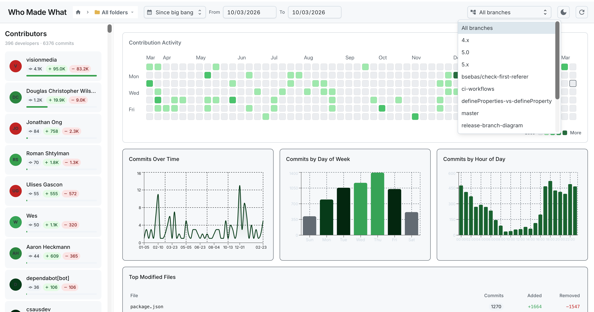

# who_made_what

Git repository contribution report — who produces what.

Run a single command to get an instant visual dashboard of contribution activity, author statistics, and file-level insights for any git repository on your machine.

<p align="center">
  
</p>

## What it does

`who_made_what` launches a local web dashboard where you browse your filesystem, pick a git repository, and instantly see:

- **Contribution heatmap** — GitHub-style grid of daily commit counts over the last 52 weeks
- **Commits timeline** — Area chart of commits per week
- **Activity by day of week** — Bar chart showing when commits happen (Mon–Sun)
- **Activity by hour** — Bar chart showing commit distribution across the 24-hour day
- **Top files** — Most frequently modified files with commit counts and line changes
- **Recent files** — Most recently updated files with author and timestamp
- **Contributor list** — All authors with commit counts, lines added/removed, and relative activity; supports multi-select filtering
- **Branch filter** — View data for a specific branch or all branches combined
- **Folder navigation** — Drill into subdirectories to scope all metrics to a specific folder
- **Date range filter** — Quick presets (24h, 7 days, month) or custom from/to dates

All data stays local. Nothing is sent to any external server.

## Setup

Since this package is hosted on GitHub Packages, you need to configure npm to resolve the `@lab34` scope from the GitHub registry.

Add the following to your project or user-level `.npmrc`:

```
@lab34:registry=https://npm.pkg.github.com
```

If the package is private, you also need to authenticate by adding a GitHub Personal Access Token (with `read:packages` scope) to `~/.npmrc`:

```
//npm.pkg.github.com/:_authToken=YOUR_GITHUB_TOKEN
```

## Usage

```bash
node bin/cli.js
```

This will:

1. Start a local server on a random available port
2. Open the dashboard in your default browser
3. Show a folder picker modal where you can browse your filesystem and select a git repository
4. Once a folder is selected, scan its full commit history and display the dashboard

No arguments are required — the repository is selected interactively through the UI.

To use a specific port:

```bash
PORT=8080 npx @lab34/who-made-what@latest
```

## Requirements

- **Node.js** >= 20
- **git** CLI installed and available in PATH

## Development

```bash
git clone https://github.com/lab34/who-made-what.git
cd who-made-what
npm install
npm run dev
```

This starts the Express API server (with `--watch` for auto-reload) and builds the client in development mode. The client dev server proxies API requests to the backend.

To build the client for production:

```bash
npm run build
```

## How it works

When launched, a folder selection modal lets you browse the OS filesystem and select any directory containing a git repository. Once selected, the tool shells out to the local `git` binary to parse branch lists, commit logs (with `--numstat`), and directory trees (`ls-tree`). All parsing happens in-process — there are no database dependencies or external services.

The Express server serves both the REST API and the pre-built React SPA on a single port. The frontend uses MUI Joy for the UI components and Recharts for the visualizations.

## License

MIT
